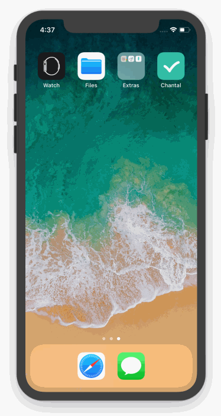

  

 

  <b>Chantal App</b>
  
To-do list iOS app (Swift 4)

## Demo

## Motivation

It's been over 2 years since I built an iOS app and a lot has changed in the iOS ecosystem since then. For instance, I have an app on the App Store called <a href="" style="font-weight: bold">typs</a> which was written in Swift 1. And when I tried to open it in Xcode 9, it woundn't even let me run the app.

Hence I decided to referesh my knowledge and learn how to build a simple To-do list app from scratch for iOS 11 & Swift 4.

## Course

I found [this](https://www.udemy.com/ios-swift-build-a-to-do-list-app) really (short) and helpful course on Udemy that walks you through how to build a to-do list app.

## Additional

Curious to know what the name of the project means?

[Here's the definition of Chantal on Urban Dictionary](https://www.urbandictionary.com/define.php?term=Chantal)
